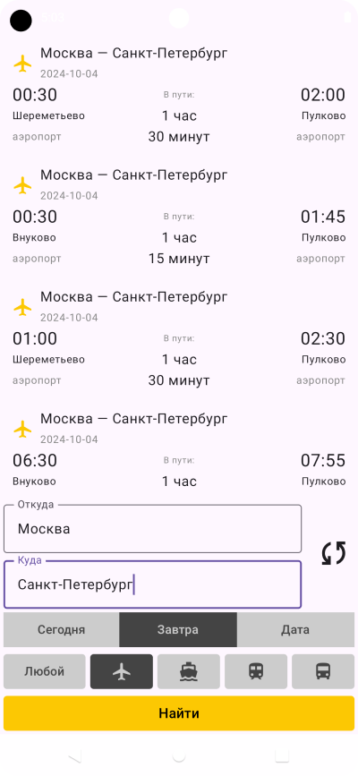
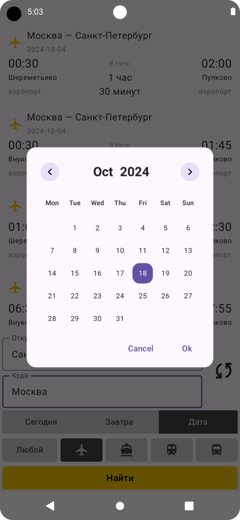
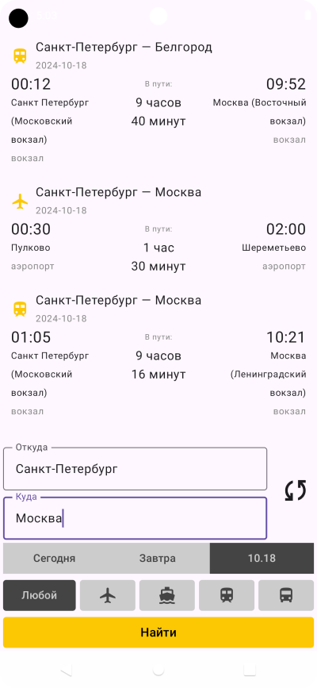

# Тестовое задание
Проект представляет из себя тестовое задание в виде небольшого приложения с расписанием движения транспорта.

Приложение использует API Яндекс Расписаний для получения информации о рейсах.

Существует возможность выбора текущей, завтрашней, или любой другой даты. Также есть возможность выбрать конкретный тип транспорта.
# Стек
Kotlin, Jetpack Compose, Retrofit, OkHttp, Koin, Clean architecture.
# Интерфейс
Далее следует несколько скриншотов с интерфейсом и примером работы приложения.

  
Скриншоты

  
  
  
  

